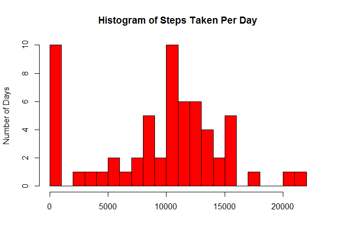
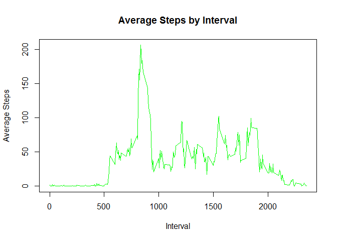
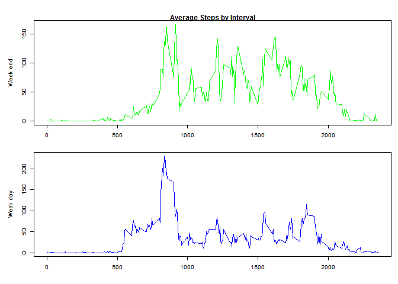
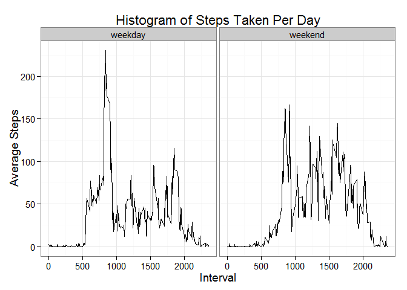

# First assignment for the Coursera Reproducible Research class with Roger Peng
Alan Fuller  
November 14, 2015  
##Loading and preprocessing the data

I used R to download the file from the website, but have commented out those commands below, as they don't need to be run every time.  Downloading didn't seem to work very well in the knitted markdown file, but is not really necessary anyway, as the file is provided in the repository provided.  This code sets the working directory to a directory "rep_data_activity" one level below the current working directory (it assumes that folder exists if the above line is commented out), it unzips the file there, and reads in the csv file.


```r
#if(!file.exists("./rep_data_activity")){dir.create("./rep_data_activity")}
setwd( "./rep_data_activity")

#fileURL1 <- "https://d396qusza40orc.cloudfront.net/repdata%2Fdata%2Factivity.zip"
#download.file(url=fileURL1, destfile="rep_data_activity.zip",mode="wb")
unzip ("rep_data_activity.zip")
activity1 <- read.csv("activity.csv", na.string="NA",
          colClasses = c("integer","Date","integer"),stringsAsFactors=FALSE)
```
 
 
I use the the dplyr and ggplot2 packages from Hadley Wickham, so I load them here.  Note that I have already installed these packages, so I have commented out the "install.packages" command. 


```r
#install.packages("dplyr")
library(dplyr)
```

```
## Warning: package 'dplyr' was built under R version 3.1.3
```

```
## 
## Attaching package: 'dplyr'
## 
## The following objects are masked from 'package:stats':
## 
##     filter, lag
## 
## The following objects are masked from 'package:base':
## 
##     intersect, setdiff, setequal, union
```

```r
#install.packages("ggplot2")
library(ggplot2)
```

```
## Warning: package 'ggplot2' was built under R version 3.1.3
```


## What is mean total number of steps taken per day?

Using functions from the dplyr package, group the data by date and then sum the number of steps by date.  Below is the code, and the output (not all dates are shown).

```r
by_date <-group_by(activity1, date)
sum_steps_by_date<- summarize(by_date,
                              sum_steps=sum(steps, na.rm=TRUE))
sum_steps_by_date
```

```
## Source: local data frame [61 x 2]
## 
##          date sum_steps
##        (date)     (int)
## 1  2012-10-01         0
## 2  2012-10-02       126
## 3  2012-10-03     11352
## 4  2012-10-04     12116
## 5  2012-10-05     13294
## 6  2012-10-06     15420
## 7  2012-10-07     11015
## 8  2012-10-08         0
## 9  2012-10-09     12811
## 10 2012-10-10      9900
## ..        ...       ...
```


Note that missing values in the dataset are ignored for this part of the assignment.

#Make a histogram of the total number of steps taken each day

The histogram is below:


```r
hist(sum_steps_by_date$sum_steps, 
          breaks=22, 
          col="red", 
          main="Histogram of Steps Taken Per Day",
          xlab="",
          ylab="Number of Days"
          )
```

 


*Calculate and report the mean and median total number of steps taken per day*


```r
Mean_median_steps <- summarize(sum_steps_by_date,
                              mean_daily_steps=mean(sum_steps),
                              median_daily_steps=median(sum_steps))
Mean_median_steps
```

```
## Source: local data frame [1 x 2]
## 
##   mean_daily_steps median_daily_steps
##              (dbl)              (int)
## 1          9354.23              10395
```


##What is the average daily activity pattern?

*Make a time series plot (i.e. type = "l") of the 5-minute interval (x-axis) and the average number of steps taken, averaged across all days (y-axis)

First, calculate the average number of steps taken for each interval across all days:

```r
by_interval <-group_by(activity1, interval)
avg_steps_by_interval<- summarize(by_interval,
                              avg_steps=mean(steps, na.rm=TRUE))
```

Then create the time series plot:


```r
attach(avg_steps_by_interval)
plot(interval, avg_steps,
     ylab="Average Steps",
     xlab="Interval",
     main="Average Steps by Interval",
     col="green",
     type="l"
)
```

 

```r
detach(avg_steps_by_interval)
```

*Which 5-minute interval, on average across all the days in the dataset, contains the maximum number of steps?*

To get the 5 minute interval with the maximum number of steps, subset the average steps by interval data set using the "which.max" function, which returns the row with the max value in the column specified.  


```r
max_interval <-avg_steps_by_interval[which.max(avg_steps_by_interval$avg_steps),]
max_interval
```

```
## Source: local data frame [1 x 2]
## 
##   interval avg_steps
##      (int)     (dbl)
## 1      835  206.1698
```

##Imputing missing values

Note that there are a number of days/intervals where there are missing values (coded as NA). The presence of missing days may introduce bias into some calculations or summaries of the data.

*Calculate and report the total number of missing values in the dataset (i.e. the total number of rows with NAs)*

The total number of missing values in the dataset can be simply calculated as follows:

```r
sum(is.na(activity1$steps))
```

```
## [1] 2304
```


*Devise a strategy for filling in all of the missing values in the dataset. The strategy does not need to be sophisticated. For example, you could use the mean/median for that day, or the mean for that 5-minute interval, etc.*

My strategy for filling in the missing values is to fill in the missing values with the mean across days for the 5 minute intervals.  The mean across days for each 5 minute interval was calculated above and stored as avg_steps_by_interval.

*Create a new dataset that is equal to the original dataset but with the missing data filled in.*

I create the new data set by merging the average steps for each interval onto the activity data set, and then using the ifelse function to create a new variable, called new_steps, which contains the average number of steps if the original value is missing, or else just keeps the original value. 


In the chunk of code below, I also re-calculate the sum of steps for each day based on the new column with the average steps per interval replacing the missing values.  


```r
activity2 <- merge(activity1,avg_steps_by_interval,by.x="interval",by.y ="interval",all.x=TRUE )
activity2 <- mutate(activity2,
          new_steps=ifelse(is.na(steps),{avg_steps},{steps}))
by_date_no_nulls <-group_by(activity2, date)
sum_steps_by_date_no_nulls<- summarize(by_date_no_nulls,
                                        new_steps=sum(new_steps))
sum_steps_by_date_no_nulls
```

```
## Source: local data frame [61 x 2]
## 
##          date new_steps
##        (date)     (dbl)
## 1  2012-10-01  10766.19
## 2  2012-10-02    126.00
## 3  2012-10-03  11352.00
## 4  2012-10-04  12116.00
## 5  2012-10-05  13294.00
## 6  2012-10-06  15420.00
## 7  2012-10-07  11015.00
## 8  2012-10-08  10766.19
## 9  2012-10-09  12811.00
## 10 2012-10-10   9900.00
## ..        ...       ...
```


*Make a histogram of the total number of steps taken each day and Calculate and report the mean and median total number of steps taken per day. Do these values differ from the estimates from the first part of the assignment? What is the impact of imputing missing data on the estimates of the total daily number of steps?*

The histogram is below:


```r
hist(sum_steps_by_date_no_nulls$new_steps, 
               breaks=22, 
               col="blue", 
               main="Histogram of Steps Taken Per Day, Nulls Replaced",
               xlab="",
               ylab="Number of Days"
          )
```

 

Yes, replacing the missing values with the average value for each interval does make the data differ.  In particular, we see that the data takes more the shape of the normal distribution.  Without null values counted, there are many days with 0 steps--something that is unlikely to be true.  Replacing those values with the average values for each interval appears to bring those missing days to look like an "average" day.  

Calculate the mean and median number of steps (with missing values replaced) as follows:


```r
Mean_median_new_steps <- summarize(sum_steps_by_date_no_nulls,
                               mean_daily_steps=mean(new_steps),
                               median_daily_steps=median(new_steps))
Mean_median_new_steps
```

```
## Source: local data frame [1 x 2]
## 
##   mean_daily_steps median_daily_steps
##              (dbl)              (dbl)
## 1         10766.19           10766.19
```

We see that the mean number of steps increases slightly when calculating with missing values replaced, from 10,396 to 10,766.  When calculating without missing values, the mean is much lower than the median, at 9354.  With missing values replace, the mean value matches the median value at 10,766.  

##Are there differences in activity patterns between weekdays and weekends?

For this part the weekdays() function may be of some help here. Use the dataset with the filled-in missing values for this part.

*Create a new factor variable in the dataset with two levels -- "weekday" and "weekend" indicating whether a given date is a weekday or weekend day.*

Here is the new data set:

```r
activity3 <- mutate(activity2,
                    week_day=weekdays(date),
                    week_end=ifelse((week_day=="Saturday"|week_day=="Sunday"),"weekend","weekday")
                    )
by_interval3 <-group_by(activity3, week_end,interval)
avg_steps_week_end <- summarize(by_interval3,
                                  avg_steps=mean(new_steps))
avg_steps_week_end
```

```
## Source: local data frame [576 x 3]
## Groups: week_end [?]
## 
##    week_end interval  avg_steps
##       (chr)    (int)      (dbl)
## 1   weekday        0 2.25115304
## 2   weekday        5 0.44528302
## 3   weekday       10 0.17316562
## 4   weekday       15 0.19790356
## 5   weekday       20 0.09895178
## 6   weekday       25 1.59035639
## 7   weekday       30 0.69266247
## 8   weekday       35 1.13794549
## 9   weekday       40 0.00000000
## 10  weekday       45 1.79622642
## ..      ...      ...        ...
```


*Make a panel plot containing a time series plot (i.e. type = "l") of the 5-minute interval (x-axis) and the average number of steps taken, averaged across all weekday days or weekend days (y-axis).*

I actually make two different versions of this plot.  The first, immediately below, is similar to the example provided by Professor Deng, with both plots in the same column:


```r
par(mfrow=c(2,1))
par(mar = c(3,4, 1, 1), oma = c(1, 1, 2, 0))
par(cex=0.6)
with(avg_steps_week_end[avg_steps_week_end$week_end=="weekend",],
     plot(interval, avg_steps,
     ylab="Week end",
  #   xlab="Interval",
     main="Average Steps by Interval",
     col="green",
     type="l"
))

with(avg_steps_week_end[avg_steps_week_end$week_end=="weekday",],
     plot(interval, avg_steps,
          ylab="Week day",
          xlab="Interval",
         # main="Average Steps by Interval",
          col="blue",
          type="l"
     ))
```

 

The second, below, uses ggplot2 by Hadley Wickham.  I like this plot a little better, but it is in a side-by-side format.


```r
ggplot(data=avg_steps_week_end, aes(x=interval, y=avg_steps)) +
     geom_line() +
     facet_grid(.~week_end)+
     theme_bw(base_size = 14)+
     labs(title="Histogram of Steps Taken Per Day",
          x="Interval", y="Average Steps")
```

 


It does appear that weekend activity is different than week day activity.  On week ends, there are a higher number of steps at various intervals throughout the day, but on weekdays there tends to be a high number of steps within a few given intervals early in the day, but then relatively lower numbers of steps throughout the rest of the day.


This completes the assignment.
